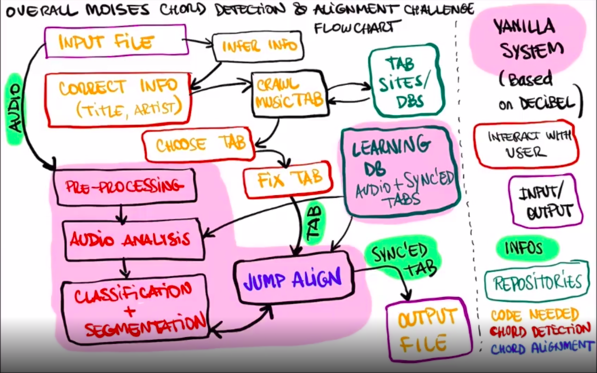

#**Funcionamento**

*->Como entrada, será entregue um áudio. A partir do áudio, iremos coletar os dados como nome da música e cantor, procuraremos a cifra em sites de cifra, e confirmaremos com o usuário se é a cifra correta. Em seguida trataremos ela e jogaremos as duas entradas para gerar a saída no formato Json com acordes em seus tempos*